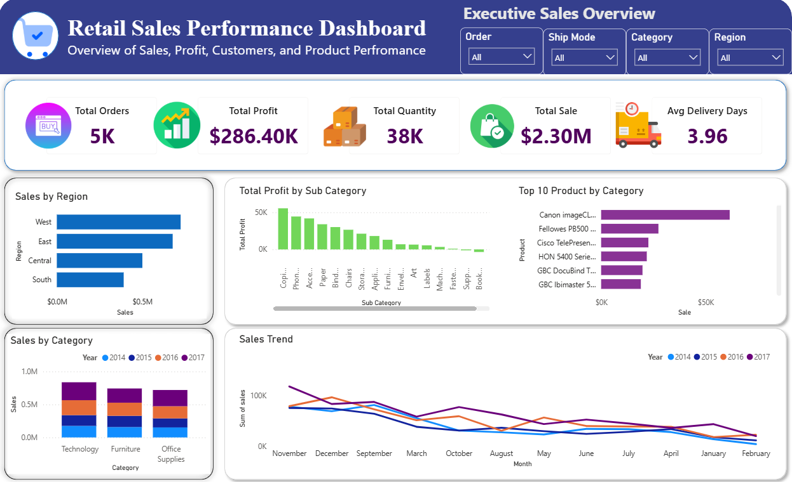
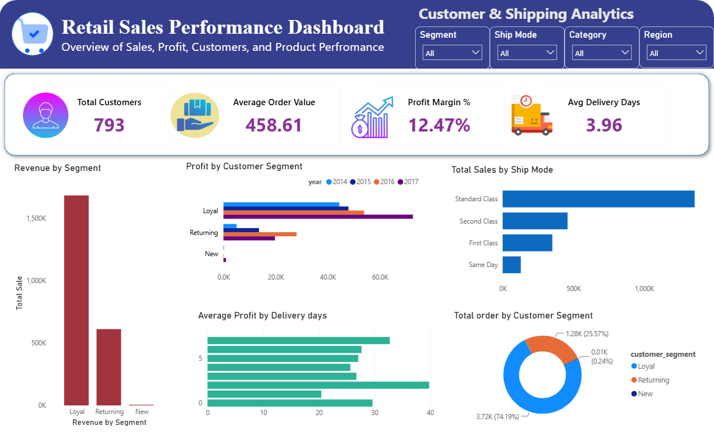
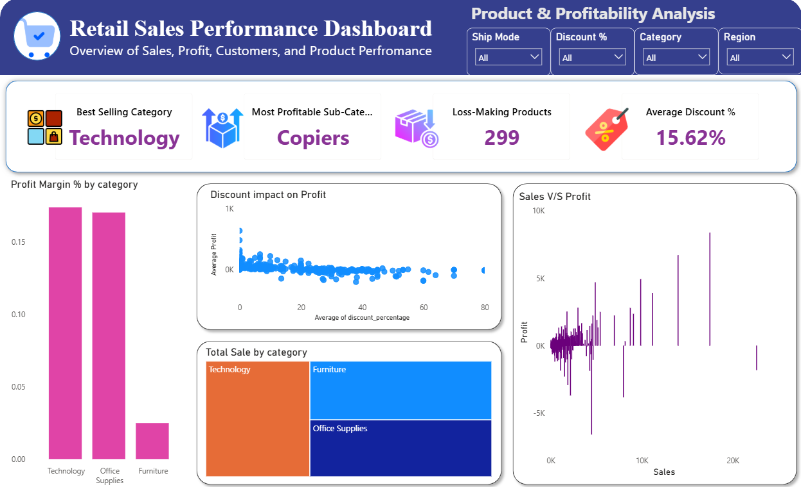

<h1 align="center">📊 Retail Sales and Profit Analysis</h1>

<p align="center">
An End-to-End Data Analytics Project using <b>Python, PostgreSQL & Power BI</b>
</p>

<p align="center">
Transforming raw retail sales data into actionable business insights through data cleaning, SQL analysis, and interactive dashboards.
</p>

<p align="center">


</p>

---

# 📖 Project Overview

Retail businesses generate large volumes of transactional data every day. Converting this raw data into meaningful insights is essential for improving sales performance, understanding customer behavior, optimizing shipping operations, and increasing profitability.

This project demonstrates a complete **end-to-end data analytics workflow** using a public retail dataset from **Kaggle**. The dataset was cleaned, transformed, analyzed, and visualized using industry-standard tools including **Python, PostgreSQL, and Power BI**.

Throughout the project, I independently performed data cleaning, feature engineering, SQL analysis, dashboard development, and business insight generation. AI was used as a learning assistant to understand concepts, troubleshoot errors, and improve implementation while ensuring I understood each step of the process.

The final result is an interactive Power BI dashboard that enables users to explore business performance through multiple perspectives including sales trends, customer analytics, shipping efficiency, product performance, and profitability.

---

# 🎯 Project Objectives

The primary objective of this project is to simulate a real-world business intelligence workflow by transforming raw retail data into actionable insights that support data-driven decision-making.

The project focuses on:

✅ Cleaning and preparing raw retail sales data using **Python & Pandas**

✅ Performing feature engineering to create additional business metrics

✅ Loading the cleaned dataset into **PostgreSQL**

✅ Solving real business problems using SQL queries

✅ Building an interactive and professional Power BI dashboard

✅ Identifying sales trends, customer behavior, and profitability patterns

✅ Presenting business insights through intuitive visualizations

---

# 🛠️ Tech Stack

| Technology | Purpose |
|------------|---------|
| 🐍 **Python** | Data cleaning, preprocessing, and feature engineering |
| 📊 **Pandas** | Data manipulation and transformation |
| 🗄️ **PostgreSQL** | Business analysis using SQL queries |
| 📈 **Power BI** | Interactive dashboard development and data visualization |
| 📂 **Git & GitHub** | Version control and project portfolio |
| 💻 **Jupyter Notebook** | Data exploration and preprocessing |

---

# 🔄 Project Workflow

```text
                 📥 Raw Retail Dataset (Kaggle)
                              │
                              ▼
          🧹 Data Cleaning & Preprocessing (Python)
                              │
                              ▼
              ⚙️ Feature Engineering (Pandas)
                              │
                              ▼
              🗄️ PostgreSQL Database Loading
                              │
                              ▼
           📊 Business Analysis using SQL Queries
                              │
                              ▼
         📈 Interactive Dashboard Development
                     (Power BI + DAX)
                              │
                              ▼
          💡 Business Insights & Decision Support
```

---

# 📂 Repository Structure

```text
Retail-Sales-and-Profit-Analysis/
│
├── 📁 Dashboard
│   └── Retail_Sales_Dashboard.pbix
│
├── 📁 Dataset
│   └── SuperstoreAnalysis_Cleaned.csv
│
├── 📁 Python
│   └── Retail_Sales_Data_Cleaning.ipynb
│
├── 📁 SQL
│   └── analysis_queries.sql
│
├── 📁 Images
│   ├── Dashboard_Page1.png
│   ├── Dashboard_Page2.png
│   └── Dashboard_Page3.png
│
├── 📄 README.md
└── 📄 LICENSE
```

---

## ⭐ Project Highlights

- 📊 Interactive **3-page Power BI Dashboard**
- 🗄️ **24+ SQL business queries** for real-world business analysis
- 🧹 Data cleaning and feature engineering using **Python**
- 📈 Professional KPI cards, charts, maps, and slicers
- 💡 Business insights across sales, customers, shipping, discounts, and profitability
- 🚀 Portfolio-ready project demonstrating an end-to-end analytics workflow

---

# 📊 Dashboard Preview

The project consists of **three interactive Power BI dashboard pages**, each designed to answer key business questions and provide actionable insights into retail business performance.


---

## 📈 Dashboard 1 – Executive Sales Overview




### Key Highlights

- 💰 Total Sales
- 📈 Total Profit
- 📦 Total Orders
- 🛒 Total Quantity Sold
- 🚚 Average Delivery Days
- 🌍 Sales by Region
- 🏙️ Sales by State & City
- 📅 Sales Trend Over Time
- 📂 Category-wise Sales Performance
- 🔍 Interactive Filters and Slicers

---

## 👥 Dashboard 2 – Customer & Shipping Analysis




### Key Highlights

- 👥 Total Customers
- 💵 Average Order Value
- 📊 Profit Margin (%)
- 🏆 Most Profitable Category
- 🎯 Customer Segment Analysis
- 🚚 Shipping Mode Performance
- ⏱️ Average Delivery Time
- 📈 Delivery Time vs Profit Analysis

---

## 📦 Dashboard 3 – Product & Profitability Analysis



### Key Highlights

- 🏆 Best Selling Category
- 💰 Most Profitable Sub-Category
- 🎯 Average Discount
- 📉 Loss-Making Products
- 📊 Top 10 Best-Selling Products
- 💸 Discount Impact on Profit
- 🌍 Profit by State
- 📈 Sales vs Profit Analysis

---

# 📖 Dashboard Walkthrough

## 📊 Page 1 – Executive Sales Overview

The first dashboard page provides a high-level overview of overall business performance.

It enables stakeholders to quickly evaluate:

- Overall Sales Performance
- Total Business Profit
- Regional Revenue Distribution
- Sales Trends by Year and Month
- Best Performing States
- Best Performing Cities
- Product Category Performance

This page serves as an executive summary for monitoring business performance at a glance.

---

## 👥 Page 2 – Customer & Shipping Analysis

The second dashboard focuses on customer purchasing behavior and shipping performance.

Key analyses include:

- Customer Segmentation
- Revenue by Customer Segment
- Average Order Value
- Profit Margin
- Shipping Mode Performance
- Average Delivery Time
- Relationship between Delivery Time and Profit

This page helps identify valuable customers while evaluating operational efficiency.

---

## 📦 Page 3 – Product & Profitability Analysis

The final dashboard explores product-level performance and profitability.

It includes:

- Category Performance
- Sub-Category Profitability
- Top Selling Products
- Loss-Making Products
- Discount Analysis
- Profit by State
- Sales vs Profit Comparison

This dashboard supports pricing decisions, inventory planning, and profitability analysis.

---

# ❓ Business Questions Answered

The project answers **24+ real-world business questions** across different business domains.

## 📈 Sales Analysis

- Which state generates the highest revenue?
- Which city generates the highest sales?
- Which region contributes the highest revenue?
- Which year generated the highest sales?
- Which month generated the highest revenue?
- Which quarter generated the highest sales?
- How do monthly sales trends change across different years?

---

## 👥 Customer Analysis

- Which city has the highest number of unique customers?
- Which customer segment generates the highest revenue?
- Which customer segment generates the highest profit?
- Which customer segment places the most orders?
- Which customer segment has the highest average order value?

---

## 🚚 Shipping & Operations

- What is the average delivery time?
- Which shipping mode generates the highest sales?
- Is longer delivery time associated with lower profit?
- Which shipping mode has the shortest delivery time?

---

## 📦 Product Performance

- What are the Top 10 best-selling products?
- Which category generates the highest revenue?
- Which sub-category generates the highest profit?
- Which products are generating losses despite high sales?

---

## 💰 Discount & Profitability

- Does giving higher discounts reduce profit?
- At what discount percentage do products become unprofitable?
- Which category receives the highest average discount?
- Which states experience the highest losses?

---

# 🗄️ SQL Analysis

Business insights were extracted using **PostgreSQL** through a collection of analytical SQL queries.

The SQL analysis involved:

- Aggregate Functions
- GROUP BY
- ORDER BY
- CASE Statements
- Common Business Metrics
- Customer Segmentation Analysis
- Revenue Analysis
- Profitability Analysis
- Shipping Performance Analysis
- Product Performance Analysis

More than **24 SQL queries** were written to answer real-world business questions and transform raw transactional data into meaningful insights.

---

# 🧹 Python Data Cleaning

Data preprocessing was performed using **Python** and **Pandas** before loading the dataset into PostgreSQL.

The data preparation process included:

- Importing the raw dataset
- Exploring the dataset structure
- Handling missing values
- Removing duplicate records
- Converting data types
- Creating new business features
- Calculating delivery days
- Creating customer segments
- Calculating discount percentage
- Creating profit margin
- Creating order value categories
- Exporting the cleaned dataset for SQL and Power BI analysis

The cleaned dataset served as the foundation for both SQL analysis and Power BI dashboard development.

---
# 💡 Key Insights

The analysis uncovered several valuable business insights that can help stakeholders make informed decisions.

### 📈 Sales Performance

- Identified the highest-performing states, cities, and regions based on total sales.
- Analyzed yearly, quarterly, and monthly sales trends to understand business growth.
- Identified top-performing product categories contributing to overall revenue.

### 👥 Customer Insights

- Segmented customers based on purchasing behavior.
- Evaluated revenue, profit, and order contribution across different customer segments.
- Calculated Average Order Value (AOV) to better understand customer spending patterns.

### 🚚 Shipping & Operations

- Compared sales performance across different shipping modes.
- Measured average delivery time to evaluate operational efficiency.
- Analyzed the relationship between delivery time and profitability.

### 📦 Product Performance

- Identified the highest-selling products and categories.
- Detected products generating losses despite high sales.
- Compared profitability across categories and sub-categories.

### 💰 Discount Analysis

- Evaluated how discounts impact profitability.
- Identified categories receiving the highest average discounts.
- Highlighted states experiencing the highest losses due to discounts.

---

# 🚀 Skills Demonstrated

This project demonstrates practical skills across the complete data analytics lifecycle.

### Programming & Data Processing

- Python
- Pandas
- Jupyter Notebook
- Data Cleaning
- Data Transformation
- Feature Engineering

### Database & SQL

- PostgreSQL
- Data Import & Export
- Aggregate Functions
- CASE Statements
- GROUP BY
- ORDER BY
- Business Query Analysis

### Business Intelligence

- Power BI
- DAX Measures
- KPI Development
- Interactive Dashboards
- Data Visualization
- Dashboard Design

### Analytical Skills

- Exploratory Data Analysis (EDA)
- Sales Analysis
- Customer Analytics
- Profitability Analysis
- Shipping Performance Analysis
- Business Insight Generation
- Data Storytelling

### Tools

- Git
- GitHub
- VS Code
- PostgreSQL
- Power BI Desktop

---

# ⚙️ Installation & Usage

## 1️⃣ Clone the Repository

```bash
git clone https://github.com/AbhiShinde93/retail-sales-profit-analysis.git
```

---

## 2️⃣ Navigate to the Project Directory

```bash
cd retail-sales-profit-analysis
```

---

## 3️⃣ Install Required Python Libraries

```bash
pip install pandas sqlalchemy psycopg2
```

---

## 4️⃣ Project Workflow

1. Open the Jupyter Notebook.
2. Run the data cleaning and preprocessing steps.
3. Export the cleaned dataset.
4. Import the dataset into PostgreSQL.
5. Execute the SQL queries provided in the SQL folder.
6. Open the Power BI dashboard (.pbix).
7. Connect Power BI to PostgreSQL.
8. Refresh the data model and explore the interactive dashboard.

---

# 📂 Dataset

- **Dataset:** Retail Superstore Dataset
- **Source:** Kaggle
- **Purpose:** Educational and portfolio project

The dataset is publicly available and is used solely for learning and portfolio demonstration purposes.

---

# 🔮 Future Improvements

Potential enhancements for future versions of this project include:

- 📈 Sales Forecasting using Machine Learning
- 🤖 Customer Segmentation with Clustering Algorithms
- 📦 Inventory Demand Prediction
- ☁️ Cloud Database Integration
- 🔄 Automated ETL Pipeline
- 🌐 Power BI Service Deployment
- 📊 Advanced DAX Calculations
- 📱 Mobile-Optimized Dashboard
- 📉 Predictive Business Analytics

---

# 👨‍💻 Author

## Abhishek Shinde

Final-Year Computer Science Engineering Student with a strong interest in Data Analytics, Business Intelligence, and Data Visualization.

This project reflects my ability to work across the complete analytics workflow—from raw data preparation and SQL analysis to building interactive dashboards that communicate meaningful business insights.

### Connect with Me

- **GitHub:** https://github.com/AbhiShinde93
- **LinkedIn:** linkedin.com/in/abhishekshinde9395

---

# 📄 License

This project is licensed under the **MIT License**.

You are welcome to use, modify, and share this project for educational purposes in accordance with the license terms.

---

# ⭐ Support

If you found this project helpful or interesting, consider giving it a ⭐ on GitHub.

Your feedback and suggestions are always welcome.

---

<h3 align="center">
Thank you for visiting this repository! 🚀
</h3>

<p align="center">
If you enjoyed exploring this project, don't forget to ⭐ the repository.
</p>
